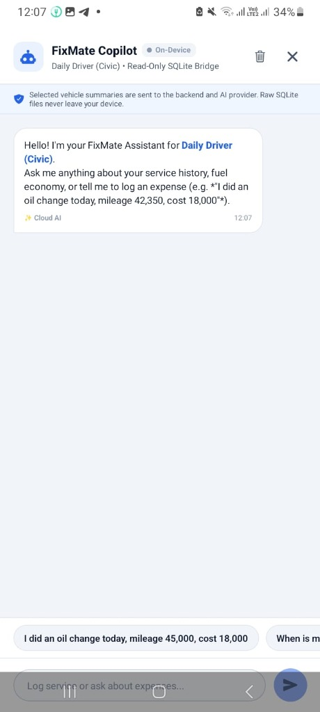
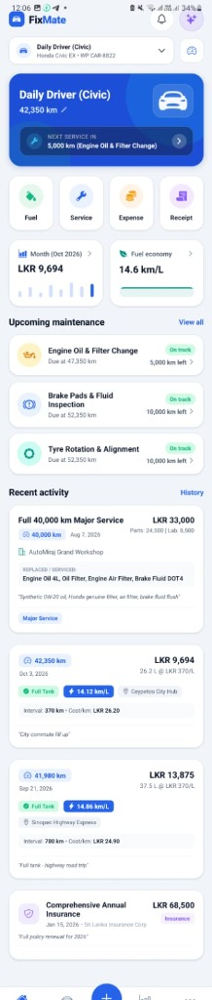
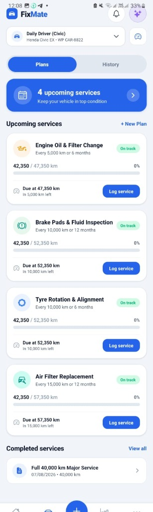
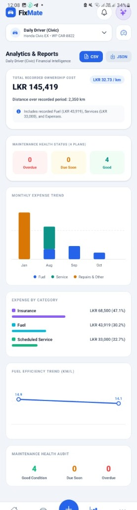
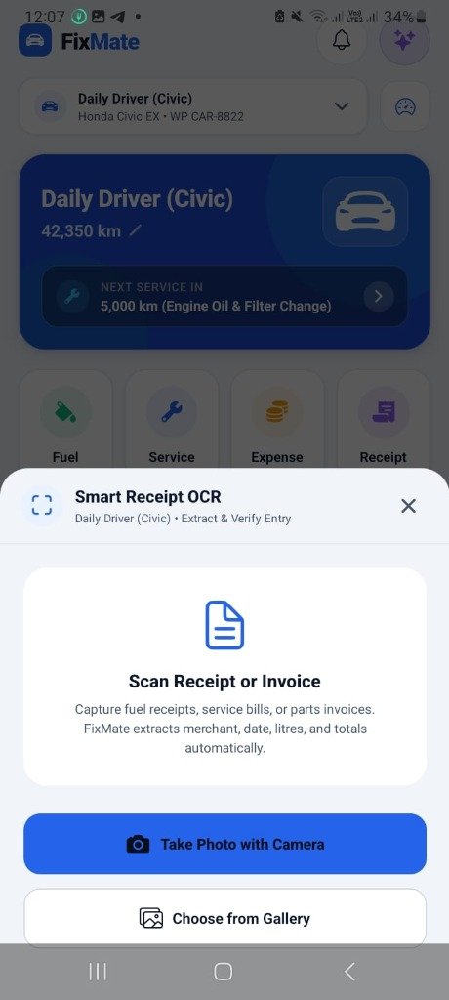
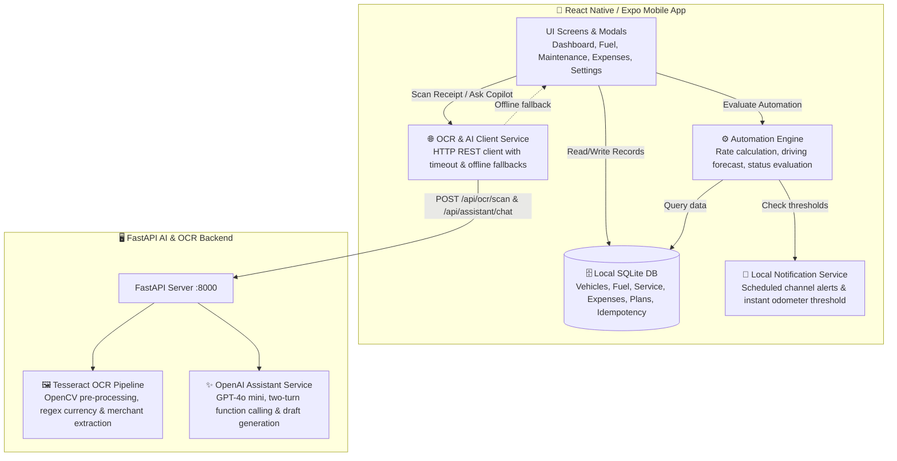

# 🚗 FixMate — Intelligent Vehicle Maintenance & Fleet Management

[](https://expo.dev/)
[](https://reactnative.dev/)
[](https://docs.expo.dev/versions/latest/sdk/sqlite/)
[](https://fastapi.tiangolo.com/)
[](#test-results)

**FixMate** is a modern, privacy-first mobile application for vehicle maintenance tracking, fuel economy monitoring, intelligent receipt OCR scanning, and conversational AI assistance. Built with React Native, Expo, local SQLite, and a FastAPI companion backend.

---

## 📸 Application Screenshots

<p align="center">
  
  
  
  
  
</p>

| 1. Dashboard | 2. AI Copilot | 3. Smart Receipt OCR | 4. Maintenance Plans | 5. Financial Analytics |
|:---:|:---:|:---:|:---:|:---:|
| Vehicle status, health metrics & recent activity | Natural language queries & draft creation | Automated receipt camera/gallery scanner | Interval schedules & explainable forecasts | Expense category breakdown & fuel trends |

---

## 🏗️ Architecture & Data Flow



---

## ✨ Core Features

1. **Multi-Vehicle Garage Management**:
   - Manage cars, SUVs, motorcycles, vans, and trucks.
   - Independent service schedules, fuel histories, and odometer tracking per vehicle.
2. **Unified Financial Tracking**:
   - Double-counting prevention: fuel costs tracked via fuel logs, services via service records, and standalone expenses isolated.
   - Monthly and categorical expenditure breakdown with visual charts.
3. **Automated Maintenance Schedules & Forecasting**:
   - *"Whichever comes first"* rule (elapsed mileage vs. calendar time).
   - Explainable driving rate forecasting ($\Delta\text{km} / \Delta\text{days}$) based on recorded odometer intervals.
4. **Smart Receipt OCR**:
   - Camera/gallery receipt scanning with OpenCV grayscale, adaptive thresholding, and deterministic metadata extraction (merchant, date, total, odometer).
5. **Conversational AI Copilot (OpenAI / Local Fallback)**:
   - Natural language queries (*"When is my next oil change?"*, *"What was my fuel spend last month?"*).
   - Automatic draft action creation with human-in-the-loop review and transactional SQLite deduplication.
6. **Data Portability**:
   - Full JSON backup export & restore with relational ID preservation.
   - CSV export for spreadsheet analysis.

---

## 🔒 Privacy & Data Policy

- **100% Local by Default**: All garage vehicles, odometer updates, fuel logs, and service records are stored exclusively in your local on-device SQLite database.
- **AI & OCR Transparency**:
  - Receipt images are transmitted only when the user explicitly triggers "Scan Receipt".
  - Chat queries send localized vehicle summary context (current odometer, service list, recent fuel metrics) to the configured backend.
  - Zero sensitive personal information is stored on external servers.

---

## 🚀 Getting Started & Setup

### Prerequisites
- Node.js (v18+)
- Python 3.10+ (for OCR & AI backend)
- Expo CLI (`npx expo`) and EAS CLI (`npx eas-cli@latest`)

### 1. Mobile Client Setup

```bash
# Clone the repository
git clone https://github.com/HimashaSawani/fixmate.git
cd fixmate

# Install dependencies
npm install

# Start local development server
npx expo start
```

### 2. Backend Setup (AI & OCR)

```bash
cd backend

# Create and activate virtual environment
python -m venv venv
# Windows
.\venv\Scripts\activate
# macOS/Linux
source venv/bin/activate

# Install dependencies
pip install -r requirements.txt

# (Optional) Set OpenAI API Key for live cloud LLM
set OPENAI_API_KEY=your_openai_api_key_here

# Start the FastAPI server (accessible over local network)
uvicorn main:app --host 0.0.0.0 --port 8000
```

> **Note on Physical Device Testing**: When running the app on a physical phone, `localhost` points to the phone itself. Open **Settings > AI & OCR Server Connection** in FixMate and enter your PC's local Wi-Fi IP address (e.g. `http://192.168.1.50:8000`).

---

## 📦 Building Standalone Preview APK

To build a standalone installable Android APK via Expo Application Services (EAS):

```bash
# 1. Log in to your EAS account
npx eas-cli@latest login

# 2. Build the Android APK using the preview profile
npx eas-cli@latest build --profile preview --platform android
```

Once the build finishes, download the `.apk` file directly to your Android device.

---

## 🧪 Automated Test Verification

FixMate includes a strict end-to-end invariant test suite ([`test_e2e_release_audit.ts`](./test_e2e_release_audit.ts)) validating database consistency, idempotency, and isolation rules:

```bash
npx tsx test_e2e_release_audit.ts
```

### Test Results (16/16 Passed):
| # | Invariant Tested | Result |
|---|---|---|
| 1 | Monthly expense filter strictly isolates current vs. prior months | ✅ Passed |
| 2 | Persistent SQLite idempotency blocks duplicate AI draft confirmation | ✅ Passed |
| 3 | Legitimate identical records with distinct draft IDs succeed | ✅ Passed |
| 4 | Active vehicle switching blocks cross-vehicle record contamination | ✅ Passed |
| 5 | Missing AI extraction fields remain strictly null without hallucination | ✅ Passed |
| 6 | Service confirmation automatically re-evaluates maintenance status | ✅ Passed |
| 7 | Multi-vehicle creation and independent odometer tracking | ✅ Passed |
| 8 | Dynamic vehicle switching in AI Copilot updates context | ✅ Passed |

---

## 📱 Physical Device Verification Checklist

Before final portfolio presentation, perform these manual device checks on the installed APK:

- [ ] **Offline Execution**: Disable Wi-Fi/data. Open app, create a fuel entry and vehicle, close app from recent apps, restart, verify record persistence.
- [ ] **Local Notifications**: Verify test alert in **Settings > Send Test Notification**.
- [ ] **OCR & Live Copilot**: Test receipt scan and AI Copilot with backend connected. Verify that when backend is unreachable, app switches cleanly to offline deterministic assistant.
- [ ] **Full Backup & Restore**: Export JSON backup, reinstall or reset demo data, restore JSON backup and confirm complete data integrity.

---

## ⚠️ Known Limitations & Portfolio Notes

1. **Expo Go Notifications**: In Expo SDK 53+, remote push notifications are disabled in the Expo Go client. Use the standalone preview APK for native notification testing.
2. **OCR Image Quality**: Tesseract OCR performance depends on lighting, focus, and receipt condition. Incomplete scans prompt manual confirmation in the review dialog.
3. **Multi-User Production Hosting**: For production deployment outside portfolio demos, configure an HTTPS reverse proxy (Caddy/Nginx) with JWT user authentication and rate limiting.

---

## 📄 License

FixMate is licensed under the MIT License. Developed for portfolio demonstration.
